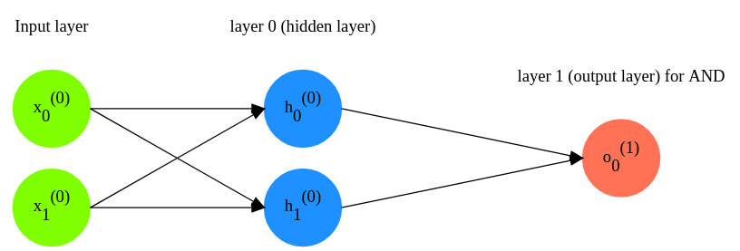

# Multilayer perceptron for solving AND-task (for two arguments)

## Possible input and output values:
```
0 ^ 0 = 0
0 ^ 1 = 0
1 ^ 0 = 0
1 ^ 1 = 1
```

## Theory
See ref. https://en.wikipedia.org/wiki/Logical_conjunction

## Neural network's architecture

