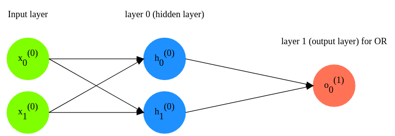

# Multilayer perceptron for solving OR-task (for two arguments)

## Possible input and output values:
```
0 V 0 = 0
0 V 1 = 1
1 V 0 = 1
1 V 1 = 1
```

## Theory
See ref. https://en.wikipedia.org/wiki/Logical_disjunction

## Neural network's architecture
