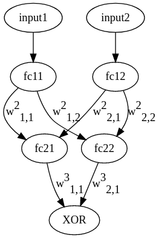

# Multilayer perceptron for solving XOR-task (for two arguments)

## Possible input and output values:
```
0 ⊕ 0 = 0
0 ⊕ 1 = 1
1 ⊕ 0 = 1
1 ⊕ 1 = 0
```

## Theory
See ref. https://en.wikipedia.org/wiki/Exclusive_or

## Neural network's architecture
