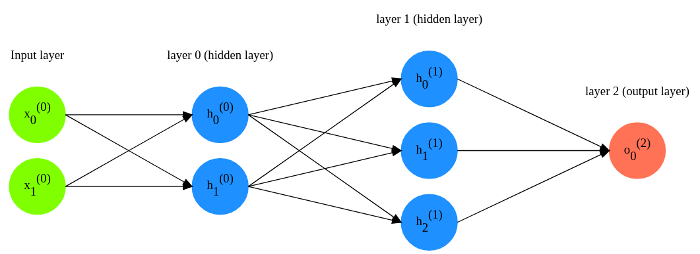
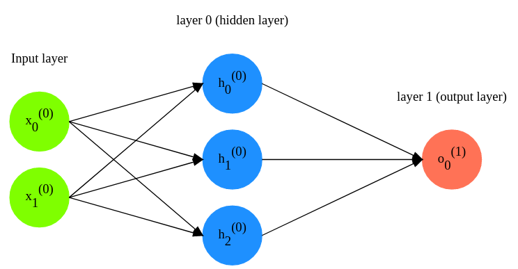

# Multilayer perceptron

This example just shows how to use [ImportFromFile(...)](../../network.go#L61), [Backpropagate(...)](../../network.go#L29), [Feedrorward(...)](../../network.go#L20) functions

**Neural network's architecture for [ExampleOne](main.go#L17)**

**Neural network's architecture for [ExampleTwo](main.go#L58)**

